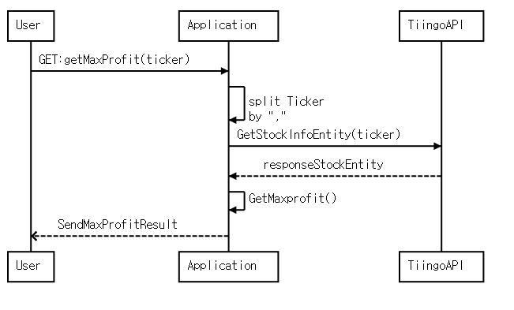

# getMaxProfitREST

### How To Use

1. 프로그램을 실행함
2. TICKER(미국 기업 코드 4자리)를 를 입력한다.(,를 통해 여러개 입력 가능)

``` 
curl -X GET "http://localhost:8080/getMaxProfit?ticker=AAPL,IBM" -H "accept: */*"
```

3. 결과 반환

```
[{"lowdate":"2020-04-01","highdate":"2020-08-26","maxprofit":265.18,"etc":"","ticker":"AAPL"},{"lowdate":"2020-04-01","highdate":"2020-06-08","maxprofit":30.61,"etc":"","ticker":"IBM"}]
```
---
### Sequence Diagram


---

사용한 미국 주식 API : [tiingo](https://api.tiingo.com) 

현재 발견된 문제점.

1. 액면분할해서 가격이 줄어든 경우 판달 할 수가 없음 

- 2020년 8월 31일 이후로 애플의 주식 가격은 1/4이 되어 가격이 줄어들었는데 이를 고려하지 않음.

